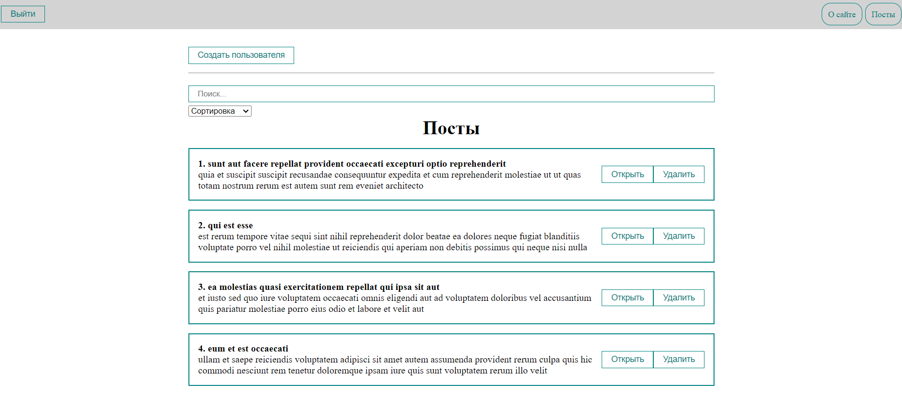

# My App with Endless-scroll Posts

**Welcome to my awesome app!** This application is designed to provide users with an endless stream of engaging posts, along with a range of convenient features such as a login system, search functionality, post creation, and comment viewing.

## Technologies Used

- React
- JavaScript
- Axios

## Features

### Endless Posts

With my app, users can scroll through an infinite number of posts, ensuring they always have fresh and exciting content to explore. Say goodbye to boredom!

### Login System

To enhance user experience users can create an account, log in, and access the app.

### Search Functionality

Finding specific posts is a breeze with the search functionality. Users can simply enter relevant keywords, and the app will display the most relevant results in real-time.

### Post Creation

Do you have something interesting to share? With my app, users can create their own posts and contribute to the community. Express yourself and engage with others!

### Comment Viewing

Engage in meaningful conversations by exploring the comments section of any chosen post. Gain insights, share your thoughts, and connect with like-minded individuals.

## Getting Started

To get started with my app, follow these steps:

1. Clone this repository to your local machine.
2. Install the necessary dependencies using the package manager of your choice.
3. Run the app locally using the development server.
4. Explore the app's features and enjoy the endless stream of captivating posts!

## Contributing

I welcome contributions from the developer community to make this app even more amazing. Feel free to submit pull requests or open issues if you come across any bugs or have suggestions for improvements.

## License

This project is licensed under the [MIT License](LICENSE). Feel free to use the code and customize it according to your needs.

---

Thank you for considering my app! I hope you find it enjoyable and useful. If you have any questions or need assistance, please don't hesitate to reach out. Happy exploring!
